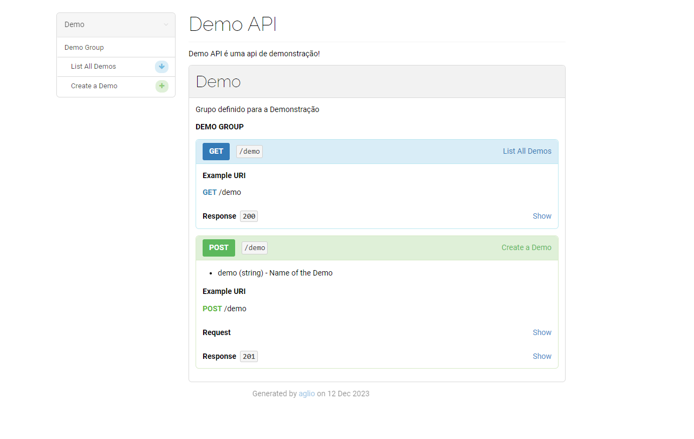

documentação oficial: [apiblueprint.org](apiblueprint.org)

"O API Blueprint é simples e acessível a todos os envolvidos no ciclo de vida da API. Sua sintaxe(baseada em md) é concisa, mas expressiva. Com o API Blueprint você pode projetar e prototipar rapidamente APIs a serem criadas ou documentar e testar APIs de missão crítica já implantadas"

Para começar, crie um arquivo do tipo md ou apib. Será nele onde a documentação da api será escrita.

Agora dentro do arquivo, começe com: 
### Nome e Metadados
```apib
FORMAT: 1A
HOST: /api/v1

# Demo API

Demo API é uma api de demonstração!
```

**FORMAT:** é a versão do API Blueprint usado.
**HOST:** é a URL padrão que a API terá.

O primeiro '#' é o nome da API,  seguido por sua descrição.

### Defina um Grupo de Recursos
Os Grupos de Recursos são os conjuntos de Recursos com suas definições. Para criá-lo, é necessário usar a **palavra chave 'Group'**

```apib
# Group Demo

Grupo referente as demos 
```

### Defina os Recursos
Cada recurso deve ser definido com seu nome e url.

```apib
## Demo Group [/demo]
```

> recurso: "List All"
> endpoint: /demo 

### Ações
Cada recurso pode conter mais de uma ação, sendo elas representadas pelos nomes e métodos http. Para defini-las, use três '#', seu nome e seu método.

```apib
### List All Demos [GET]
```

Cada ação deve conter uma resposta com seu código de status, podendo ter também um corpo.
Podem ser declarados com +, * ou -.

```apib
+ Response 200
		 
		 {
			{
				"id": 1,
				"demo": "Clash Royale"
			},
			{
				"id": 2,
				"demo": "Farcry 3"
			},
			{
				"id": 3,
				"demo": "GTA SA"
	        }
	    }
```

#### Post
```apib
### Create a Demo [POST]

+ demo (string) - Name of the Demo

+ Request 
		
		{
			"demo": "CS 2"
		}

+ Response 201
	
		{
			{
				"id": 1,
				"demo": "Clash Royale"
			},
			{
				"id": 2,
				"demo: "Farcry 3"
			},
			{
				"id": 3,
				"demo: "GTA SA"
	        },
	        {
		        "id": 4
				"demo": "CS 2"
			}
	    }
```

Neste exemplo de Post, a ação "Create a Demo" possui um requisito denominado "demo", que descreve o seu tipo. Já abaixo, temos também o request, que possui um corpo contendo a nova demo. Já na resposta, temos o código 201 com todas as demos já criadas. 

### Ferramentas
O API Blueprint possui uma serie de ferramentas para auxiliar e complementar a documentação da API. Saiba mais aqui: [ferramentas](https://apiblueprint.org/tools.html)

Para renderizar a documentação em uma página html, use o [aglio](https://github.com/danielgtaylor/aglio):
```bash
aglio -i api.apib -o index.html
```
Neste exemplo, a página ficou assim:


Outra ferramentas muito usada é o [drakov](https://www.npmjs.com/package/drakov), capaz de gerar um mock server. Para usar:
```bash
drakov -f api.apib -p 4000
```
#### Código de exemplo completo
```apib

FORMAT: 1A
HOST: /api/v1

# Demo API

Demo API é uma api de demonstração!

# Group Demo

Grupo definido para a Demonstração 

## Demo Group [/demo]

### List All Demos [GET]

+ Response 200

        {
            {
                "id": 1,
                "demo": "Clash Royale"
            },
            {
                "id": 2,
                "demo": "Farcry 3"
            },
            {
                "id": 3,
                "demo": "GTA SA"
            }
        }


### Create a Demo [POST]

+ demo (string) - Name of the Demo

+ Request 

        {
            "demo": "CS 2"
        }

+ Response 201

        {
            {
                "id": 1,
                "demo": "Clash Royale"
            },
            {
                "id": 2,
                "demo: "Farcry 3"
            },
            {
                "id": 3,
                "demo: "GTA SA"
            },
            {
                "id": 4
                "demo": "CS 2"
            }
        }

```


[def]: printa